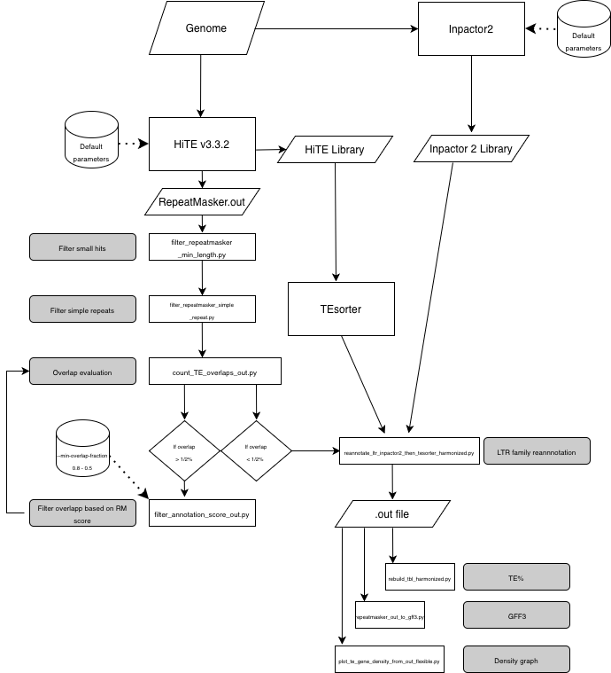

# TE_annotationrefinement
Pipeline for plant transposable element annotation refinement.  
This Pipeline use HiTE results (repeatmasker .out and library files), Tesorter results (with the HiTE library files) and the Inpactor 2 results.
It processes the HiTE results repeatmasker .out file to remove overlapping annotation based on repeatmasker score and annotate the LTR retrotranspososn at the family level.  
Prerequisite:   
-[HiTE] (https://github.com/CSU-KangHu/HiTE) annotation results: .out file   
-[TEsorter] (https://github.com/zhangrengang/TEsorter) Hite_library annotation results: confident_TE.cons.fa.rexdb-plant.cls.tsv   
-[Inpactor2] (https://github.com/simonorozcoarias/Inpactor2) Inpactor 2 library results: Inpactor2_library.fasta  

# Workflow
HiTE RepeatMasker .out  
        |  
        v  
Length/Simple repeat filtering  
        |  
        v  
Overlap estimation and filtering  
        |  
        v  
Inpactor2 reannotation  
        |  
        v  
TEsorter refinement  
        |  
        v  
LTR Class harmonization  
        |  
        +--> RepeatMasker-like .tbl  
        +--> GFF3  

# Installation 
git clone https://github.com/rg-ird/TE_annotationrefinement.git
cd HiTE_pipeline

# Usage
python hite_pipeline.py --param hite_pipeline_config_template.txt

  

        
